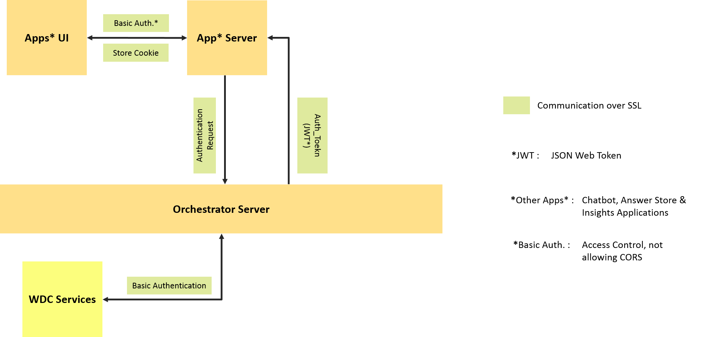

# Summary

- [Olivia Conversation App v2.1.0](#a-olivia-conversation-app-v200)
	- [Description](#a1-description)
	- [Demonstration](#a2-demonstration)
    - [Mandatory Linked Applications](#a3-mandatory-linked-applications) 
- [Architecture Overview](#b-architecture-overview)
    - [Applications Layer](#b1-applications-layer)
    - [Applications Layer](#b2-services-layer)
    - [Simplified Use Case](#b3-simplified-use-case) 
    - [Security Design](#b4-security-design) 
- [App Deployment and Continuous Integration](#c-app-deployment-and-continuous-integration)
    - [Using Cloudfoundry CLI tool to Deploy your Application](#c1-using-cloudfoundry-cli-tool-to-deploy-your-application)
    - [Deploying the App Locally](#c2-deploying-the-app-locally)
    - [Getting the Env & Global Variables ready](#c3-getting-the-env-&-global-variables-ready)
		- [Adding the Server's Environment Variables](#c31-adding-the-server's-environment-variables)
		- [Adding the App's Public Global Variables](#c31-adding-the-app's-public-global-variables)
- [Change Log](#d-change-log)
- [RoadMap](#e-roadmap)
- [ScreenShots](#f-screenshots)


# A. Olivia Conversation App v2.1.0

## A.1. Description:
**Olivia Conversation 2.1** has been redesigned and optimized through it users feedback.

Not only features has been added, but the entire app has been tweaked to take part of a production-level asset (an entire ecosystem), that will enable:

* A more Integrated and Industrial Approach: Limiting Olivia’s Conversation App to the dialog part of the asset, makes it easier to maintain and create dedicated features like testing and context editing.

* A RESTful API: Clients can now develop their own UI for the end-users, and use the Orchestrator API to interact with Conversation and other Watson Developer Cloud services.

* A Brand new UI: The new UI is easier to customize for every new project. It also features some new admin tools for automated conversation testing, and displaying top intents with confidence levels.


## A.2. Demonstration:
You can access a live demo of the **Olivia Conversation 2.1** using the following:

```
 * Url : https://olivia-conversation.w3ibm.mybluemix.net

 * Username : olivia
 * Password : olivia
```


## A.3. Mandatory Linked Applications:
**Olivia Orchestrator** is an asset to use Watson Conversation service with more integrated features as:
* Save conversation logs in DB
* Retrieve the history of a customer conversation
* Use customer data in DB to customize the conversation

For more information please visit : https://github.ibm.com/CognitiveAssetFactory/Olivia-Orchestrator


# B. Architecture Overview


The application consists of 2 core layers:
- Custom Developed Application
- Watson Developer Cloud Services


## B.1. Applications Layer:


## B.2. Services Layer:


- 1_ Conversation, see the [detailed documentation] : http://www.ibm.com/watson/developercloud/conversation.html

- 2_ ElephantSQL, see the [detailed documentation] : https://console.ng.bluemix.net/docs/services/ElephantSQL/index.html


## B.3. Simplified Use Case:


## B.4. Security Design:




# C. App Deployment and Continuous Integration

## C.1. Using Cloudfoundry CLI tool to deploy your application:

**To build the application:**

1_ Download and install the [Cloudfoundry CLI](https://github.com/cloudfoundry/cli) tool.

2_ Git clone the project `https://github.ibm.com/CognitiveAssetFactory/Olivia-Conversation`

3_ Navigate to the `Olivia-Conversation` folder

4_ Connect to Bluemix in the command-line tool:

 For US Region

 ```sh
 $ cf api https://api.ng.bluemix.net
 ```

 ```sh
 $ cf login -u <your user ID>
 ```

5_ Create the Conversation service in Bluemix:

 ```sh
 $ cf create-service conversation free conversation-service
 ```

6_ Create the ElephantSQL service in Bluemix:

 ```sh
 $ cf create-service elephantsql tiny-turtle elephantsql-service
 ```
 
7_ Push it live:

 ```sh
 $ cf push <application-name>
 ```
 The name you use determinates your application URL initially, such as `<application-name>.mybluemix.net`.

## C.2. Deploying the App Locally:

The application uses [Node.js](http://nodejs.org/) and [npm](https://www.npmjs.com/).

1_ Copy the Domain name of your `Olivia-Orchestrator App` in Bluemix to a `.env` file in the root.
- Look at `.env.example` as an example to create your `.env` file.

2_ Install [Node.js](http://nodejs.org/).

3_ Open the terminal, go to the project folder, and run this command:
```sh
npm install
```

4_  Start the application by running this command:
```sh
npm start
```

5_ Open `http://localhost:3000` in a browser.

_Note: If you are interested in deploying you local application or the changes you have made locally to Bluemix, go to "**C.1. Using Cloudfoundry CLI tool to deploy your application**".

## C.3. Getting the Env & Global Variables Ready:

The App needs a number of variables to work properly. You should either set the variables directly in `.env` file or `public/js/global.js`.

These variables are grouped in two categories :


### C.3.1. Adding the Server's Environment Variables:

The **Server Variables** are :
- 1_ The Orchestrator domain name used to access Olivia's Orchestrator:
	- `API_DOMAIN` = "exp: https://<appname>-orchestrator.mybluemix.com"
	
### C.3.2. Adding the App's Public Global Variables:

The **Public Global Variables** are located in `Public/js/global.js`. These variables stem from the Orchestrator Server and Conversation Service configuration:
- 1_ The Conversation's confidence triggers (optional - only used with blind test):
	- `appSettings.triggers.high` = "The confidence level triggering a direct answer through on the conversation service"
	- `appSettings.triggers.medium` = "The confidence level triggering a disambiguation process by displaying the two top intents"
	- `appSettings.triggers.low` = "The confidence level preventing the conversation service from displaying an response"

- 2_ The iFrame's url (used as background by the UI):
	- `appSettings.iframeUrl` = "https://w3.ibm.com"
	
	
	

# D. Change Log

##v2.1.0:

- App UI : Overall style enhancement and animation stability improvement.
- App Login : A freshly designed Login page.
- Authentication : Replaced server authentication with database auth. This suppose that you're user credentials are stored in the SQL database linked to the [Orchestrator](https://github.ibm.com/CognitiveAssetFactory/Olivia-Orchestrator)


##v2.0.0:

- Architecture Change : The application is no longer connected directly to the Bluemix Services.
- APP UI : A new and more intuitive design has been created, in order to ehance the user's UX.
- APP Login : An authentication page has been added for more security.
- Test Capabilities : Test features (Unit and Automated tests) has been added directly to the UI.


# E. RoadMap

###Comming soon...


# F. ScreenShots

### F.1. Login Page:


### F.2. Chatbot Question eg.1:


### F.3. Chatbot Question eg.2:


### F.3. Top Intents Easy Acess:


"# Olivia-Test" 
